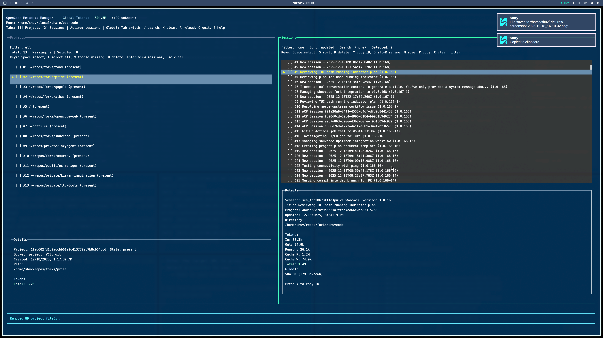
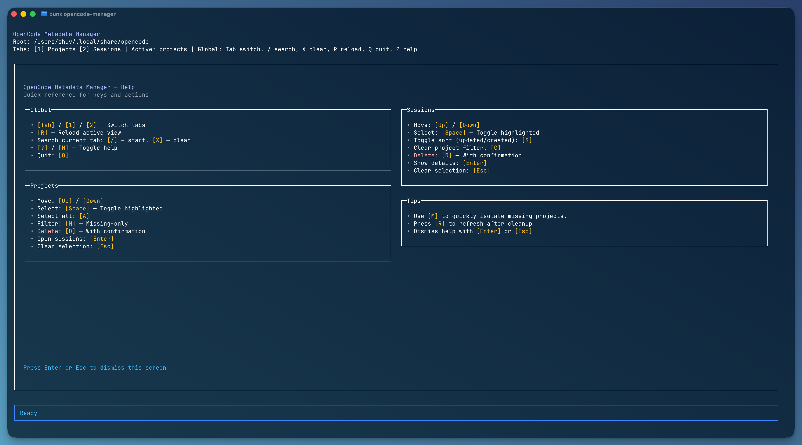

> **Note:** This is an independent, community-maintained project created by fans of OpenCode. We are not affiliated with SST Corp. or the official OpenCode project. For the official OpenCode CLI, visit [opencode.ai](https://opencode.ai).


# OpenCode Metadata Manager

Terminal UI for inspecting, filtering, and pruning OpenCode metadata stored on disk. The app is written in TypeScript, runs on Bun, and renders with [`@opentui/react`](https://github.com/open-tui/opentui).

## Screenshots

<p align="center">
  
  <br />
  <em>Main workspace with Projects (left) and Sessions (right) panels.</em>
</p>

<p align="center">
  
  <br />
  <em>Contextual help overlay with key bindings and tips.</em>
</p>

## Features
- List both OpenCode projects and sessions from a local metadata root.
- Filter by "missing only", bulk-select, and delete metadata safely.
- Jump from a project directly to its sessions and keep contextual filters.
- **Fuzzy search** across session titles and metadata (`/` to focus, results ranked by relevance).
- **View session chat history** with full conversation context (`V` to open viewer).
- **Search across all chat content** in sessions within a project (`F` to search).
- Rename sessions inline (`Shift+R`) with title validation.
- Move sessions between projects (`M`) preserving session ID.
- Copy sessions to other projects (`P`) with new session ID generation.
- Rich help overlay with live key hints (`?` or `H`).
- Zero-install via `bunx` so even CI shells can run it without cloning.
- **Token counting**: View token usage per session, per project, and globally.

## Token Counting

The TUI displays token telemetry from OpenCode's stored message data at three levels:

1. **Per-session**: Shows a breakdown in the session Details pane (Input, Output, Reasoning, Cache Read, Cache Write, Total).
2. **Per-project**: Shows total tokens for the highlighted project in the Projects panel.
3. **Global**: Shows total tokens across all sessions in the header bar.

### Token Definitions
| Field | Description |
|---|---|
| **Input** | Tokens in the prompt sent to the model |
| **Output** | Tokens generated by the model |
| **Reasoning** | Tokens used for chain-of-thought reasoning (some models) |
| **Cache Read** | Tokens read from provider cache |
| **Cache Write** | Tokens written to provider cache |
| **Total** | Sum of all token fields |

### Behavior Notes
- Token data is read from `storage/message/<sessionId>/*.json` files (assistant messages only).
- If token telemetry is missing or unreadable, the display shows `?` instead of `0`.
- Token summaries are cached in memory and refreshed when you press `R` to reload.
- Large datasets are handled with lazy computation to avoid UI freezes.

## Requirements
- [Bun](https://bun.sh) **1.1.0+** (developed/tested on 1.2.x).
- A node-compatible terminal (truecolor improves readability but is optional).

## Installation
```bash
# Clone the repo and install deps
git clone git@github.com:kcrommett/oc-manager.git
cd oc-manager
bun install

# Or run on demand without cloning
bunx opencode-manager --help
```

The repository ships with a focused `.gitignore`, keeping `node_modules/`, caches, and logs out of Git history.

## Usage

The manager provides both a Terminal UI (TUI) and a scriptable CLI interface.

### Terminal UI (TUI)

The TUI is the default interface when no subcommand is provided:

```bash
# Preferred: zero-install command
bunx opencode-manager --root ~/.local/share/opencode

# Local dev run (forwards extra args after --)
bun run tui -- --root ~/.local/share/opencode

# Legacy Python wrapper (still used by some automation)
./manage_opencode_projects.py --root ~/.local/share/opencode -- --help
```

Keyboard reference:
- **Global**: `Tab`/`1`/`2` switch tabs, `/` search (fuzzy), `X` clear search, `R` reload, `Q` quit, `?` help.
- **Projects**: `Space` toggle selection, `A` select all, `M` missing-only filter, `D` delete, `Enter` jump to Sessions.
- **Sessions**: `Space` select, `S` toggle sort, `V` view chat, `F` search chats, `D` delete, `Y` copy ID, `Shift+R` rename, `M` move, `P` copy, `C` clear filter.
- **Chat Search**: Type query + `Enter` to search, `Up/Down` navigate, `Enter` opens result, `Esc` close.
- **Chat Viewer**: `Esc` close, `Up/Down` navigate, `PgUp/PgDn` jump 10, `Home/End` first/last, `Y` copy message.

### Command Line Interface (CLI)

The CLI provides scriptable access to all management operations. Use subcommands to list, search, and modify metadata.

#### Global Options

| Option | Default | Description |
|--------|---------|-------------|
| `-r, --root <path>` | `~/.local/share/opencode` | Root path to OpenCode metadata store |
| `-f, --format <fmt>` | `table` | Output format: `json`, `ndjson`, or `table` |
| `-l, --limit <n>` | `200` | Maximum number of records to return |
| `--sort <order>` | `updated` | Sort order: `updated` or `created` |
| `-y, --yes` | `false` | Skip confirmation prompts for destructive operations |
| `-n, --dry-run` | `false` | Preview changes without executing |
| `-q, --quiet` | `false` | Suppress non-essential output |
| `-c, --clipboard` | `false` | Copy output to clipboard |
| `--backup-dir <path>` | — | Directory for backup copies before deletion |

#### Commands Overview

```
opencode-manager
├── projects
│   ├── list      List projects (--missing-only, --search)
│   └── delete    Delete project metadata (--id, --yes, --dry-run, --backup-dir)
├── sessions
│   ├── list      List sessions (--project, --search)
│   ├── delete    Delete session metadata (--session, --yes, --dry-run, --backup-dir)
│   ├── rename    Rename a session (--session, --title)
│   ├── move      Move session to another project (--session, --to)
│   └── copy      Copy session to another project (--session, --to)
├── chat
│   ├── list      List messages in a session (--session, --include-parts)
│   ├── show      Show a specific message (--session, --message or --index)
│   └── search    Search chat content across sessions (--query, --project)
├── tokens
│   ├── session   Show token usage for a session (--session)
│   ├── project   Show token usage for a project (--project)
│   └── global    Show global token usage
└── tui           Launch the Terminal UI
```

#### Exit Codes

| Code | Meaning |
|------|---------|
| 0 | Success |
| 1 | General error |
| 2 | Usage error (missing required options, invalid arguments) |
| 3 | Resource not found (invalid project/session/message ID) |
| 4 | File operation error (backup or delete failure) |

## Development Workflow
1. Install dependencies with `bun install`.
2. Run the TUI via `bun run tui` (pass storage flags after `--`).
3. Use `bun run dev` for watch mode.
4. Type-check with `bun run typecheck` (`tsc --noEmit`).

### Project Structure
```
src/
  bin/opencode-manager.ts   # Bun-native CLI shim exposed as the bin entry
  tui/
    app.tsx                 # Main TUI implementation (panels, search, help)
    index.tsx               # TUI entrypoint with launchTUI(), parseArgs(), bootstrap()
manage_opencode_projects.py # Legacy Python launcher for backwards compatibility
opencode-gen.sh             # Spec snapshot helper script
PROJECT-SUMMARY.md          # Extended design notes & roadmap
```

## Packaging & Publish
1. `bun install`
2. `bun run typecheck`
3. Update `version` in `package.json`
4. `npm publish` (package exposes the `opencode-manager` bin with public access)

## Troubleshooting
- **tmux failures**: Some sandboxed environments block tmux sockets under `/tmp`. Run `bun run tui` directly if tmux refuses to start.
- **Rendering glitches**: OpenTUI expects all textual content inside `<text>` nodes. When adding UI components, follow the existing helpers (e.g., `KeyChip`, `Bullet`).
- **Search won’t clear**: Press `Esc` while the search bar is focused, or hit `X` while in normal navigation.

## Contributing
Issues and pull requests are welcome. Please include reproduction steps for metadata edge cases and run `bun run typecheck` before submitting patches.

## License
MIT © OpenCode contributors. See [`LICENSE`](./LICENSE).
